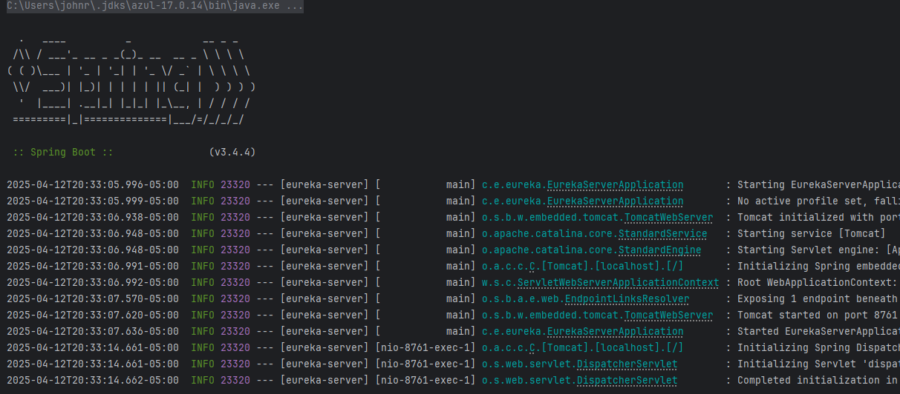
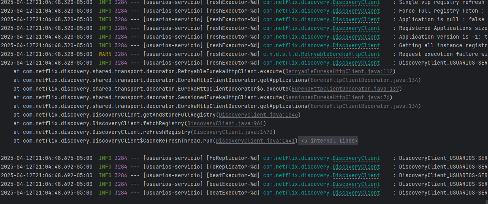
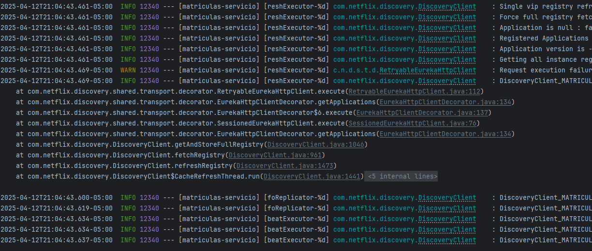

# Sistema educativo microservicios - John Alexander Rivera Rivera

markdown

# Gestión de Productos Reactivo

Proyecto básico para aprender **Spring Boot**, **Spring Security**, **programación reactiva con WebFlux**, **internacionalización (i18n)** en 3 idiomas (español, inglés, francés), y conexión con **MongoDB** usando operaciones CRUD.


## Tecnologías Usadas

-	Java 17
-	Spring Boot 3.x
-	Spring WebFlux (reactivo)
-	Spring Security
-	Spring Data Reactive MongoDB
-	Internacionalización (i18n)
-	Postman (para pruebas)
-	Lombok
-   Docker
-   MongoDB
-   JWT

---
## Estructura del Proyecto
│   .gitattributes
│   .gitignore
│   docker-compose.yml
│   img.png
│   img_1.png
│   img_2.png
│   img_3.png
│   mvnw
│   mvnw.cmd
│   pom.xml
│   README.md
│   SE.zip
│   tree.txt
│   
├───.github
│   └───workflows
│           workflows.yml
│           
├───.idea
│       .gitignore
│       compiler.xml
│       encodings.xml
│       jarRepositories.xml
│       misc.xml
│       vcs.xml
│       workspace.xml
│       
├───.mvn
│   └───wrapper
│           maven-wrapper.properties
│           
├───.vscode
│       settings.json
│       
├───asignaturas-servicio
│   │   .gitattributes
│   │   .gitignore
│   │   application-docker.properties
│   │   Dockerfile
│   │   Dockerfile - asignaturas.txt
│   │   mvnw
│   │   mvnw.cmd
│   │   pom.xml
│   │   
│   ├───.mvn
│   │   └───wrapper
│   │           maven-wrapper.properties
│   │           
│   ├───src
│   │   ├───main
│   │   │   ├───java
│   │   │   │   └───com
│   │   │   │       └───example
│   │   │   │           └───asignaturas
│   │   │   │               │   AsignaturasServicioApplication.java
│   │   │   │               │   
│   │   │   │               ├───controller
│   │   │   │               │       AsignaturaController.java
│   │   │   │               │       
│   │   │   │               ├───model
│   │   │   │               │       Asignatura.java
│   │   │   │               │       
│   │   │   │               ├───repository
│   │   │   │               │       AsignaturaRepository.java
│   │   │   │               │       
│   │   │   │               ├───security
│   │   │   │               │       SecurityConfig.java
│   │   │   │               │       
│   │   │   │               └───service
│   │   │   │                       AsignaturaService.java
│   │   │   │                       
│   │   │   └───resources
│   │   │           application.properties
│   │   │           
│   │   └───test
│   │       └───java
│   │           └───com
│   │               └───example
│   │                   └───asignaturas
│   │                       │   AsignaturasServicioApplicationTests.java
│   │                       │   
│   │                       ├───controller
│   │                       │       AsignaturaControllerIntegrationTest.java
│   │                       │       AsignaturaControllerTest.java
│   │                       │       
│   │                       └───service
│   │                               AsignaturaServiceTest.java
│   │                               
│   └───target
│       │   asignaturas-0.0.1-SNAPSHOT.jar
│       │   asignaturas-0.0.1-SNAPSHOT.jar.original
│       │   
│       ├───classes
│       │   │   application.properties
│       │   │   
│       │   └───com
│       │       └───example
│       │           └───asignaturas
│       │               │   AsignaturasServicioApplication.class
│       │               │   
│       │               ├───controller
│       │               │       AsignaturaController.class
│       │               │       
│       │               ├───model
│       │               │       Asignatura.class
│       │               │       
│       │               ├───repository
│       │               │       AsignaturaRepository.class
│       │               │       
│       │               ├───security
│       │               │       SecurityConfig.class
│       │               │       
│       │               └───service
│       │                       AsignaturaService.class
│       │                       
│       ├───generated-sources
│       │   └───annotations
│       ├───generated-test-sources
│       │   └───test-annotations
│       ├───maven-archiver
│       │       pom.properties
│       │       
│       ├───maven-status
│       │   └───maven-compiler-plugin
│       │       ├───compile
│       │       │   └───default-compile
│       │       │           createdFiles.lst
│       │       │           inputFiles.lst
│       │       │           
│       │       └───testCompile
│       │           └───default-testCompile
│       │                   createdFiles.lst
│       │                   inputFiles.lst
│       │                   
│       └───test-classes
│           └───com
│               └───example
│                   └───asignaturas
│                       ├───controller
│                       │       AsignaturaControllerIntegrationTest.class
│                       │       AsignaturaControllerTest.class
│                       │       
│                       └───service
│                               AsignaturaServiceTest.class
│                               
├───eureka-server
│   │   .gitattributes
│   │   .gitignore
│   │   application-docker.properties
│   │   Dockerfile
│   │   Dockerfile - eureka.txt
│   │   HELP.md
│   │   mvnw
│   │   mvnw.cmd
│   │   pom.xml
│   │   
│   ├───.mvn
│   │   └───wrapper
│   │           maven-wrapper.properties
│   │           
│   ├───.vscode
│   │       settings.json
│   │       
│   ├───src
│   │   ├───main
│   │   │   ├───java
│   │   │   │   └───com
│   │   │   │       └───example
│   │   │   │           └───eureka_server
│   │   │   │                   EurekaServerApplication.java
│   │   │   │                   
│   │   │   └───resources
│   │   │           application.properties
│   │   │           
│   │   └───test
│   │       └───java
│   │           └───com
│   │               └───example
│   │                   ├───eureka
│   │                   │       EurekaServerApplicationTests.java
│   │                   │       
│   │                   └───eureka_server
│   │                           EurekaServerApplicationTests.java
│   │                           
│   └───target
│       │   eureka-server-0.0.1-SNAPSHOT.jar
│       │   eureka-server-0.0.1-SNAPSHOT.jar.original
│       │   
│       ├───classes
│       │   │   application.properties
│       │   │   
│       │   └───com
│       │       └───example
│       │           └───eureka_server
│       │                   EurekaServerApplication.class
│       │                   
│       ├───generated-sources
│       │   └───annotations
│       ├───generated-test-sources
│       │   └───test-annotations
│       ├───maven-archiver
│       │       pom.properties
│       │       
│       ├───maven-status
│       │   └───maven-compiler-plugin
│       │       ├───compile
│       │       │   └───default-compile
│       │       │           createdFiles.lst
│       │       │           inputFiles.lst
│       │       │           
│       │       └───testCompile
│       │           └───default-testCompile
│       │                   createdFiles.lst
│       │                   inputFiles.lst
│       │                   
│       └───test-classes
│           └───com
│               └───example
│                   └───eureka_server
│                           EurekaServerApplicationTests.class
│                           
├───matriculas-servicio
│   │   .gitattributes
│   │   .gitignore
│   │   controller.txt
│   │   Dockerfile
│   │   Dockerfile - matriculas.txt
│   │   matricula.java
│   │   mvnw
│   │   mvnw.cmd
│   │   pom.xml
│   │   security config.txt
│   │   tree.txt
│   │   
│   ├───.mvn
│   │   └───wrapper
│   │           maven-wrapper.properties
│   │           
│   ├───src
│   │   ├───main
│   │   │   ├───java
│   │   │   │   └───com
│   │   │   │       └───example
│   │   │   │           └───matriculas
│   │   │   │               │   MatriculasServicioApplication.java
│   │   │   │               │   
│   │   │   │               ├───client
│   │   │   │               │       AsignaturaClient.java
│   │   │   │               │       UsuarioClient.java
│   │   │   │               │       
│   │   │   │               ├───controller
│   │   │   │               │       MatriculaController.java
│   │   │   │               │       
│   │   │   │               ├───model
│   │   │   │               │       Matricula.java
│   │   │   │               │       
│   │   │   │               ├───repository
│   │   │   │               │       MatriculaRepository.java
│   │   │   │               │       
│   │   │   │               ├───security
│   │   │   │               │       SecurityConfig.java
│   │   │   │               │       
│   │   │   │               └───service
│   │   │   │                       MatriculaService.java
│   │   │   │                       
│   │   │   └───resources
│   │   │           application.properties
│   │   │           
│   │   └───test
│   │       └───java
│   │           └───com
│   │               └───example
│   │                   └───matriculas
│   │                           MatriculasServicioApplicationTests.java
│   │                           
│   └───target
│       ├───classes
│       │       application.properties
│       │       
│       ├───generated-sources
│       │   └───annotations
│       └───maven-status
│           └───maven-compiler-plugin
│               └───compile
│                   └───default-compile
│                           createdFiles.lst
│                           inputFiles.lst
│                           
└───usuarios-servicio
    │   .gitattributes
    │   .gitignore
    │   123.txt
    │   application-docker.properties
    │   Dockerfile
    │   Dockerfile - usuarios.txt
    │   mvnw
    │   mvnw.cmd
    │   pom.xml
    │   
    ├───.mvn
    │   └───wrapper
    │           maven-wrapper.properties
    │           
    ├───.vscode
    │       settings.json
    │       
    ├───src
    │   ├───main
    │   │   ├───java
    │   │   │   └───com
    │   │   │       └───example
    │   │   │           └───usuarios
    │   │   │               │   UsuariosServicioApplication.java
    │   │   │               │   
    │   │   │               ├───controller
    │   │   │               │       AuthController.java
    │   │   │               │       UsuarioController.java
    │   │   │               │       
    │   │   │               ├───dto
    │   │   │               │       LoginRequest.java
    │   │   │               │       RegisterRequest.java
    │   │   │               │       
    │   │   │               ├───model
    │   │   │               │       Usuario.java
    │   │   │               │       
    │   │   │               ├───repository
    │   │   │               │       UsuarioRepository.java
    │   │   │               │       
    │   │   │               ├───security
    │   │   │               │       JwtAuthFilter.java
    │   │   │               │       JwtUtils.java
    │   │   │               │       SecurityConfig.java
    │   │   │               │       
    │   │   │               └───service
    │   │   │                       UsuarioService.java
    │   │   │                       
    │   │   └───resources
    │   │           application.properties
    │   │           
    │   └───test
    │       └───java
    │           └───com
    │               └───example
    │                   └───usuarios
    │                       │   UsuariosServicioApplicationTests.java
    │                       │   
    │                       └───controller
    │                               UsuarioControllerTest.java
    │                               
    └───target
        │   usuarios-0.0.1-SNAPSHOT.jar
        │   usuarios-0.0.1-SNAPSHOT.jar.original
        │   
        ├───classes
        │   │   application.properties
        │   │   
        │   └───com
        │       └───example
        │           └───usuarios
        │               │   UsuariosServicioApplication.class
        │               │   
        │               ├───controller
        │               │       AuthController.class
        │               │       UsuarioController.class
        │               │       
        │               ├───dto
        │               │       LoginRequest.class
        │               │       RegisterRequest.class
        │               │       
        │               ├───model
        │               │       Usuario.class
        │               │       
        │               ├───repository
        │               │       UsuarioRepository.class
        │               │       
        │               ├───security
        │               │       JwtAuthFilter.class
        │               │       JwtUtils.class
        │               │       SecurityConfig.class
        │               │       
        │               └───service
        │                       UsuarioService.class
        │                       
        ├───generated-sources
        │   └───annotations
        ├───generated-test-sources
        │   └───test-annotations
        ├───maven-archiver
        │       pom.properties
        │       
        ├───maven-status
        │   └───maven-compiler-plugin
        │       ├───compile
        │       │   └───default-compile
        │       │           createdFiles.lst
        │       │           inputFiles.lst
        │       │           
        │       └───testCompile
        │           └───default-testCompile
        │                   createdFiles.lst
        │                   inputFiles.lst
        │                   
        └───test-classes
---
---
## Internacionalización Endpoint de prueba:
GET /api/usuarios
yaml

---
## Seguridad
POST /usuarios/auth/login
-	Autenticación JWT
-	Usuario: `jarr1`
-	Contraseña: `Password123`

---
 
## Endpoints CRUD (Protegidos)

Método	Endpoint	Descripción
GET	`/api/productos`	Lista todos los productos
POST	`/api/productos/{id}`	Crear un nuevo producto
GET	`/api/productos/{id}`	Buscar producto por ID
PUT	`/api/productos/{id}`	Actualizar producto por ID
DELETE	`/api/productos/{id}`	Eliminar producto por ID

---

## Pruebas con Postman

1.	Usa autenticación básica con el usuario y clave.
2.	Prueba el CRUD y el endpoint `/mensaje?lang=fr`.

---

## Requisitos para ejecutar

-	Java 17
-	Maven 3.8+
-   Docker
---

## Cómo correr el proyecto

```bash
# Clonar el repositorio
git clone https://github.com/tuusuario/gestion-productos-reactivo.git

# Entrar al proyecto
cd gestion-productos-reactivo

# Ejecutar el proyecto (maven)
./mvnw spring-boot:run

# Ejecutar el proyecto (Docker)
 docker-compose up -d


pgsql

---

## 2. Archivo `.gitignore`

```gitignore
# Compiled class file
*.class
# Maven target/
!.mvn/wrapper/maven-wrapper.jar
**/target/

# Logs
*.log

# IntelliJ IDEA
.idea/
*.iml

# Eclipse
.project
.classpath
.c9/
.settings/
# VS Code
.vscode/
# OS
.DS_Store Thumbs.db

## Ejecución de Pruebas

### Pruebas Unitarias
Para ejecutar solo las pruebas unitarias:
```
./mvnw test -Dtest=ProductoServiceTest

# Pruebas de ejcucion local






